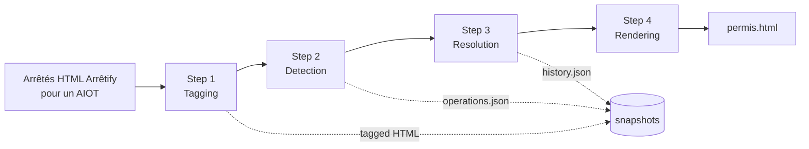
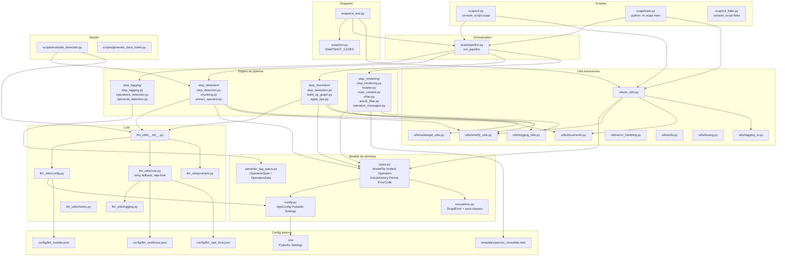

# Architecture

Vue d'ensemble du pipeline OCAPI : ce qui entre, ce qui sort, et comment les étapes
s'enchaînent.

## Vue d'ensemble

OCAPI prend en entrée un ensemble d'arrêtés préfectoraux **déjà tagués au format
[Arrêtify](https://github.com/mte-dgpr/arretify)** pour un même AIOT, et produit
un **permis consolidé HTML** qui regroupe les prescriptions toujours applicables.

Le pipeline est une fonction pure de bout en bout :

Le point d'entrée principal est [`run_pipeline`](https://github.com/mte-dgpr/ocapi/blob/main/ocapi/pipeline.py)
dans [`ocapi/pipeline.py`](https://github.com/mte-dgpr/ocapi/blob/main/ocapi/pipeline.py).

## Étapes

| Étape | Module | Entrée | Sortie | LLM |
|---|---|---|---|---|
| 1. [Tagging](pipeline-steps/tagging.md) | `ocapi/step_tagging/` | `DocumentContext` | `DocumentContext` annoté | non |
| 2. [Detection](pipeline-steps/detection.md) | `ocapi/step_detection/` | `ArreteFile` | `list[Operation]` | oui |
| 3. [Resolution](pipeline-steps/resolution.md) | `ocapi/step_resolution/` | `list[Operation]` + `list[ArreteFile]` | `ArticleHistory` | optionnel |
| 4. [Rendering](pipeline-steps/rendering.md) | `ocapi/step_rendering/` | `ArticleHistory` + arrêtés + opérations | `Permis` (HTML) | non |

La détection et le rendering peuvent être désactivés via `run_pipeline(...)`
(`enable_detection=False`, `enable_rendering=False`) ou les flags équivalents
de la CLI. C'est ce qui permet le mode **snapshot** (rejouer le pipeline sans
LLM à partir d'un `operations.json` figé).

## Modèle de données

Les types vivent dans [`ocapi/types.py`](https://github.com/mte-dgpr/ocapi/blob/main/ocapi/types.py).
Les principaux :

- `ArreteFile` — un arrêté chargé : `id` (date `YYYY-MM-DD`), `aiot`, `filename`,
  `soup` (BeautifulSoup), `file_type`, `status` (devient `False` si abrogé),
  `principal` (flag pour la consolidation).
- `NodeId` — identifiant unique d'un article : `(arrete_id, article_id)`.
  `article_id` peut être un numéro pointé (`1.2`, `I.1`, `A-3`) ou un mot-clé
  (`ALL`, `END`, `APPENDIX`, `APPENDIX:1.2`, `NEW_ARTICLE:1.2`).
- `Operation` — opération typée détectée : `id`, `source_id`, `target_id`,
  `operation_type` (`ADD` / `REPLACE` / `REMOVE`), `operand`, `sub_target`,
  `error_codes`, `confidence_score`.
- `ArticleHistory` — `Dict[NodeId, list[ArticleVersion]]`. Chaque version a
  `version`, `title`, `content`, `operation_id`, `error_codes`.
- `Permis` — trois fragments HTML (`header`, `contenu`, `other`) injectés dans
  le template [`templates/permis_consolide.html`](https://github.com/mte-dgpr/ocapi/blob/main/templates/permis_consolide.html).
- `ErrorCode` — énumération typée d'erreurs de résolution propagées sur les
  opérations puis sur les versions d'articles (voir [Resolution](pipeline-steps/resolution.md)).

## Artefacts

Pour un AIOT donné, le pipeline écrit (par défaut sous
`arretes_consolidation/<aiot>/`) :

- `operations.json` — liste sérialisée des `Operation`. Sert d'entrée au mode
  snapshot.
- `history.json` — `ArticleHistory` sérialisée.
- `permis.html` — permis consolidé final.

En parallèle, si `step_tagging` est actif, les HTMLs taggués sont écrits sous
`arretes_tagged/<aiot>/`.

## Dépendances externes

- **[Arrêtify](https://github.com/mte-dgpr/arretify)** — produit le HTML
  sémantique en entrée (sections, articles, visas, motifs, annexes, …) et
  fournit `DocumentContext`. La version supportée est verrouillée (cf.
  `SUPPORTED_ARRETIFY_VERSION` dans [`ocapi/config.py`](https://github.com/mte-dgpr/ocapi/blob/main/ocapi/config.py)).
- **LLM** — un fournisseur parmi PIAG / OpenAI / Mistral / Anthropic / Google,
  appelé pendant la détection (et marginalement pendant la résolution pour les
  sous-cibles complexes). Voir [LLM](llm.md).
- **`networkx`** — graphe orienté multi-arêtes des opérations construit pendant
  la résolution.

## Cartographie complète du code

Vue détaillée des modules, des dépendances internes et de la place des fichiers
de config et de templates.

Lecture rapide :

- **Entrées** (CLI + module main) ne connaissent qu'`io_utils`, `pipeline.run_pipeline`
  et la config Pydantic.
- **`pipeline.py`** est la seule colle entre les étapes — chaque étape ignore les
  autres.
- **`llm_utils/`** est isolé : `step_detection` et `step_resolution` n'importent
  que son `__init__` (qui sert de façade).
- **`utils/`** est partagé mais sans import croisé entre étapes.
- **Config externe** (`.env`, JSON, template) est lue à travers
  [`config.py`](https://github.com/mte-dgpr/ocapi/blob/main/ocapi/config.py)
  ou [`llm_utils/config.py`](https://github.com/mte-dgpr/ocapi/blob/main/ocapi/llm_utils/config.py).
- **Snapshots** sont un cas particulier : `snapshot_test.py` réutilise
  `run_pipeline` avec `enable_detection=False` + `enable_llm=False`.

## Décisions associées

- [ADR 0001 — Pipeline en étapes explicites](decision-records/0001-three-step-pipeline.md)
- [ADR 0002 — Détection par LLM](decision-records/0002-llm-for-detection.md)
- [ADR 0003 — Snapshot testing](decision-records/0003-snapshot-testing.md)
- [ADR 0004 — Pinning de la version Arrêtify](decision-records/0004-arretify-version-pin.md)
- [ADR 0005 — Pydantic Settings + double config](decision-records/0005-pydantic-settings-dual-config.md)
