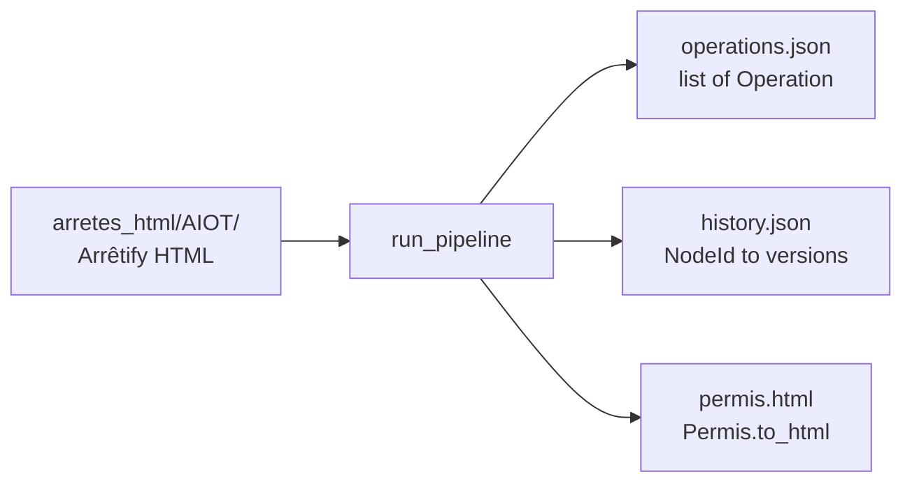

# Format des données

Référence des trois artefacts produits par le pipeline (versionnés dans
`snapshots/arretes_consolidation/<aiot>/`) ainsi que du format HTML attendu en
entrée. Les types Python correspondants vivent dans
[`ocapi/types.py`](https://github.com/mte-dgpr/ocapi/blob/main/ocapi/types.py).

## Vue d'ensemble



## Entrée — `arretes_html/<AIOT>/`

Un répertoire par AIOT, contenant un fichier HTML par arrêté. Format de
nommage attendu :

```
YYYY-MM-DD_<type>_<description>.html
```

Exemples :

- `2009-12-08_ap d'autorisation_….html`
- `2014-01-09_ap prescriptions complémentaires_….html`
- `2024-09-27_ap prescriptions complémentaires_….html`

Le format date-only `YYYY-MM-DD.html` est aussi accepté (`file_type` =
`AUTRE`). Voir [`parse_filename`](https://github.com/mte-dgpr/ocapi/blob/main/ocapi/types.py)
et `categorize_arrete` pour la liste exacte des types reconnus :

| Pattern dans le nom | `FileType` |
|---|---|
| `ap d'autorisation`, `ap enregistrement`, `ap autorisation temporaire` | `AP_AUTORISATION` |
| `ap prescriptions complémentaires` | `AP_COMPLEMENTAIRE` |
| `ap servitude d'utilité publique`, `arrêté préfectoral` | `ARRETE_PREFECTORAL` |
| (aucun match) | `AUTRE` |

Le HTML doit avoir été produit par [Arrêtify](https://github.com/mte-dgpr/arretify)
(version compatible : voir
[ADR 0004](decision-records/0004-arretify-version-pin.md)). La validation est
faite par `validate_arretify_version` à partir de l'attribut
`data-arretify_version` sur la balise `<body>`.

## `operations.json`

**Type :** `list[Operation]` sérialisée via `Operation.model_dump(mode="json")`.

### Schéma d'une opération

```json
{
  "id": "1",
  "source_id": {
    "arrete_id": "2006-12-14",
    "article_id": "2"
  },
  "target_id": {
    "arrete_id": "1995-03-24",
    "article_id": "ALL"
  },
  "operation_type": "REMOVE",
  "operand": null,
  "sub_target": {
    "type": "FULL_SECTION",
    "position": null,
    "description": "ALL"
  },
  "error_codes": [],
  "confidence_score": 100
}
```

### Champs

| Champ | Type | Description |
|---|---|---|
| `id` | `str` | Identifiant interne (compteur process). Stable au sein d'un même run. |
| `source_id.arrete_id` | `YYYY-MM-DD` | Arrêté **modificateur** (celui qui contient la prescription). |
| `source_id.article_id` | `str` | Article du modificateur. Format pointé (`1.2`), romain (`I.1`) ou lettre (`A-3`). |
| `target_id.arrete_id` | `YYYY-MM-DD` | Arrêté **modifié** (cible de l'opération). |
| `target_id.article_id` | `str` | `1.2`, `I.1`, `A-3`, ou un mot-clé : `ALL`, `END`, `APPENDIX`, `APPENDIX:x.y`, `NEW_ARTICLE:x.y`. |
| `operation_type` | `"ADD"` / `"REPLACE"` / `"REMOVE"` | Type canonique. Un `REPLACE` avec `target_article=ALL` aurait été convertí en `REMOVE` à la détection. |
| `operand` | `str \| null` | HTML du texte à insérer / substituer (avec images réhydratées). `null` pour `REMOVE` ou si extraction impossible. |
| `sub_target` | `SubTarget \| null` | Précision de portée (cf. ci-dessous). |
| `error_codes` | `list[str]` | Codes d'erreur attachés. Vide si OK. Voir [Codes d'erreur](error-codes.md). |
| `confidence_score` | `int \| null` | Score auto-évalué par le LLM (0–100). |

### `SubTarget`

```json
{ "type": "PHRASE", "position": -1, "description": "à compter du 1er janvier 2025" }
```

| Champ | Valeurs |
|---|---|
| `type` | `FULL_SECTION`, `TABLEAU`, `PHRASE`, `ALINEA`, `PARAGRAPHE`, `LIGNE_TABLEAU`, `COLONNE_TABLEAU`, `COMPLEX` |
| `position` | `int \| null`. `1` = première occurrence, `2` = deuxième, `-1` = dernière. |
| `description` | `str \| null`. Texte d'origine de la sous-cible (utilisé pour le match regex puis comme fallback LLM). |

### Exemple `REPLACE` avec operand HTML

```json
{
  "id": "2",
  "source_id": { "arrete_id": "2006-12-14", "article_id": "13" },
  "target_id":  { "arrete_id": "1977-09-21", "article_id": "34-1" },
  "operation_type": "REPLACE",
  "operand": "un dossier comprenant le plan à jour ... <a data-spec=\"section_reference\">article L. 511-1</a> ...",
  "sub_target": null,
  "error_codes": [],
  "confidence_score": 95
}
```

## `history.json`

**Type :** `Dict[str, list[ArticleVersion]]`. La clé est la sérialisation de
`NodeId` au format `"<arrete_id>#<article_id>"` (ex. `"2021-09-24#1.2.1"`).

### Schéma d'une version

```json
"2021-09-24#1.2.1": [
  {
    "version": 0,
    "title": "<h4 data-level=\"2\" data-spec=\"section_title\">Article 1.2.1. ...</h4>",
    "content": "<div data-number=\"1\" data-spec=\"alinea\">Les installations exploitées ...</div>",
    "operation_id": null
  },
  {
    "version": 1,
    "title": "<h4 data-level=\"2\" ...>Article 1.2.1. ...</h4>",
    "content": "<p>Les installations exploitées ... </p><table>...</table>",
    "operation_id": "7"
  }
]
```

### Champs

| Champ | Type | Description |
|---|---|---|
| `version` | `int` | `0` = état initial (avant toute opération). Incrémente à chaque opération appliquée avec succès. |
| `title` | `str` (HTML) | Heading de la section (`<h1>` … `<h6>`). Inchangé entre versions sauf si la modification l'a touché. |
| `content` | `str` (HTML) | Corps de l'article après application de l'opération `operation_id`. |
| `operation_id` | `str \| null` | Référence à `operations.json[*].id`. `null` pour `version: 0`. |
| `error_codes` | `list[str]` (optionnel) | Présent si la version a hérité d'une erreur (cf. [Codes d'erreur](error-codes.md)). |

La dernière version de la liste (`history[node][-1]`) est celle utilisée par
`step_rendering` pour produire le permis consolidé.

## `permis.html`

Document HTML autonome produit par
[`Permis.to_html()`](https://github.com/mte-dgpr/ocapi/blob/main/ocapi/types.py)
en injectant les trois fragments `header` / `contenu` / `other` dans le template
[`templates/permis_consolide.html`](https://github.com/mte-dgpr/ocapi/blob/main/templates/permis_consolide.html).

Structure logique :

```
<html>
  <body>
    <!-- HEADER -->
    <div data-spec="permit_title">…</div>
    <section data-spec="permit_sources">…</section>
    <section data-spec="permit_visa"><details>…</details></section>
    <section data-spec="permit_motif">…</section>

    <!-- CONTENT (AP initial consolidé) -->
    <main>
      <section data-spec="section" data-number="1.1.1" …>
        <h…>Article 1.1.1 …</h…>
        … contenu de la dernière version dans history.json …
      </section>
      … sections suivantes …
    </main>

    <!-- OTHER -->
    <section data-spec="permit_modifying_arretes">…</section>
    <section data-spec="permit_complements">…</section>
  </body>
</html>
```

## Conventions de comparaison

Les snapshots tests comparent :

- `operations.json` et `history.json` après normalisation : tri des clés,
  `strip_none_values` (suppression des `null` non-significatifs), `error_codes`
  vide retiré.
- `permis.html` après `normalize_html`
  ([`ocapi/utils/testing.py`](https://github.com/mte-dgpr/ocapi/blob/main/ocapi/utils/testing.py))
  qui standardise espaces, attributs et indentation.

Voir [Snapshot testing](snapshot-testing.md) pour la procédure complète.
