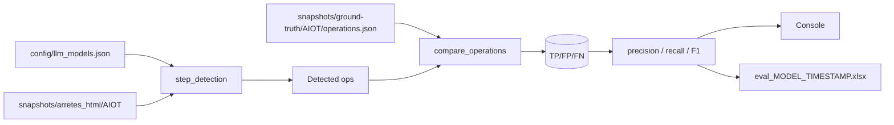

# Évaluation de la détection

Mesure de la qualité de l'**étape 1 (détection)** par comparaison à un
ground-truth annoté manuellement. Outil :
[`scripts/evaluate_detection.py`](https://github.com/mte-dgpr/ocapi/blob/main/scripts/evaluate_detection.py).

## Principe

Pour un AIOT donné :

1. Charger les arrêtés HTML (`snapshots/arretes_html/<aiot>/`).
2. Lancer `step_detection` sur chaque arrêté avec un modèle LLM choisi
   (`--model`). Comme dans le pipeline réel, le premier arrêté est traité
   comme initial : la détection démarre à `arretes[1]`.
3. Charger le ground-truth (`snapshots/ground-truth/<aiot>/operations.json`),
   annoté à la main par un humain.
4. Comparer les deux ensembles d'opérations sur la clé
   `(source_arrete, source_article, target_arrete, target_article, operation_type)`.
5. Calculer **précision / rappel / F1** par AIOT et global.



## Utilisation

```bash
# Tous les AIOT avec ground-truth
python scripts/evaluate_detection.py --model openai_gpt5mini

# Un AIOT précis
python scripts/evaluate_detection.py --model mistral_medium --aiot 0003013459

# Plusieurs AIOT
python scripts/evaluate_detection.py --model openai_gpt5nano \
    --aiot 0003013459 0005804239

# Mode verbose (DEBUG)
python scripts/evaluate_detection.py --model mistral_medium -v

# Export XLSX
python scripts/evaluate_detection.py --model openai_gpt5 --xlsx
python scripts/evaluate_detection.py --model openai_gpt5 --xlsx ./mon_eval.xlsx
```

`--model` accepte n'importe quelle `model_key` déclarée dans
[`config/llm_models.json`](https://github.com/mte-dgpr/ocapi/blob/main/config/llm_models.json).

## Critère de matching

Une opération est considérée **correctement détectée** si et seulement si la
clé `(source_arrete, source_article, target_arrete, target_article, operation_type)`
correspond exactement à une opération du ground-truth (matching multiset, donc
les doublons sont comptés correctement). Les opérations `AUTRE` du ground-truth
sont filtrées (le pipeline ne les produit pas non plus).

> Le matching ne regarde **ni l'operand, ni la sub_target, ni le score de
> confiance**. C'est volontaire : on mesure la capacité du LLM à identifier
> *quoi* est modifié, pas la qualité de l'extraction du contenu.

## Métriques

```python
precision = TP / (TP + FP)
recall    = TP / (TP + FN)
F1        = 2·precision·recall / (precision + recall)
```

- **TP** (true positives) : opérations détectées qui matchent le GT.
- **FP** (false positives) : opérations détectées qui n'existent pas dans le
  GT (faux positifs / hallucinations).
- **FN** (false negatives) : opérations du GT que le LLM a manqué.

## Sortie console

```
--- 0003013459 ---
  Ground-truth: 12  |  Detected: 14
  TP=11  FP=3  FN=1
  Precision: 0.786
  Recall:    0.917
  F1:        0.846
  Time: 42.3s  |  Tokens: 18 405  |  Cost: $0.0023

==================================================
OVERALL (openai_gpt5mini)
==================================================
  TP=42  FP=11  FN=8
  Precision: 0.792
  Recall:    0.840
  F1:        0.815
```

## Sortie XLSX

Avec `--xlsx`, le script génère un classeur (`eval_<model>_<timestamp>.xlsx`)
avec une ligne par AIOT et une ligne **TOTAL** :

| Colonne | Sens |
|---|---|
| AIOT | identifiant de l'installation |
| Ground-truth | nb d'opérations annotées |
| Détectées | nb d'opérations renvoyées par le LLM |
| TP / FP / FN | counts |
| Precision / Recall / F1 | en pourcentage |
| Temps (s) | wall-clock pour les détections |
| Tokens in / out | usage cumulé |
| Coût ($) | estimé via `_COST_PER_1M_TOKENS` |

Les fichiers `eval_*.xlsx` à la racine du repo sont des historiques d'éval
versionnés ; consulter les plus récents pour comparer les modèles.

## Coûts

Estimation basée sur les tarifs publics au moment de l'écriture du script. La
table est dans
[`scripts/evaluate_detection.py`](https://github.com/mte-dgpr/ocapi/blob/main/scripts/evaluate_detection.py)
sous `_COST_PER_1M_TOKENS`. **À tenir à jour à la main** quand les tarifs
évoluent ou qu'un nouveau modèle est ajouté.

Modèles présents par défaut : `mistral-medium-latest`, `mistral-large-latest`,
`gpt-4o`, `gpt-5*`, `claude-*`, `gemini-*`.

## Ground-truth

Stocké sous `snapshots/ground-truth/<aiot>/operations.json` au même format que
`operations.json` (cf. [Format des données](data-formats.md)). À constituer à
la main pour chaque nouvel AIOT en évaluant chaque opération identifiée par un
juriste.

Recommandations :

- Inclure aussi les opérations `AUTRE` (le script les filtrera) pour
  documenter ce que le LLM est tenté de matcher à tort.
- Ne pas mettre à jour le ground-truth après un échec d'éval — le but est
  d'identifier les régressions, pas de les masquer.
- Versionner les changements de ground-truth dans un commit dédié, en
  expliquant pourquoi (nouvelle interprétation, correction d'une erreur
  d'annotation…).

## Limites

- L'évaluation **ignore l'operand et la sub_target** : un LLM peut avoir un F1
  parfait sur la clé tout en remplissant l'operand de travers.
- Le coût est une estimation grossière (tarif d'API au moment de l'écriture,
  unique par modèle, pas de prise en compte des reasoning tokens).
- Le matching est **strict** : une différence d'`article_id` (`1.2` vs `1.2.0`)
  compte comme un échec total. Pour des analyses plus fines, dériver son propre
  matching à partir de `_operation_key`.
