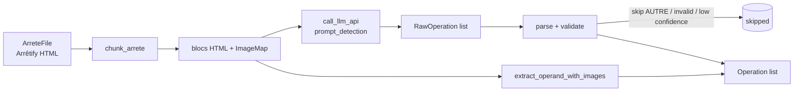

# Étape 1 — Detection

Découpe l'arrêté en blocs HTML, interroge le LLM bloc par bloc et retourne une
liste d'`Operation` typées. Module : [`ocapi/step_detection/`](https://github.com/mte-dgpr/ocapi/tree/main/ocapi/step_detection).

## Vue d'ensemble

Point d'entrée : [`step_detection(arrete_file)`](https://github.com/mte-dgpr/ocapi/blob/main/ocapi/step_detection/step_detection.py).

## Tagging

Une étape **0** facultative (`step_tagging`, [`ocapi/step_tagging/`](https://github.com/mte-dgpr/ocapi/tree/main/ocapi/step_tagging))
enrichit le HTML Arrêtify avec des spans sémantiques utilisés en aval (verbes
d'opération, références d'articles, sous-cibles…). Sortie écrite sous
`arretes_tagged/<aiot>/`. Désactivable via `--no-tagging` ; dans ce cas, les
tags pré-existants dans le HTML d'entrée sont utilisés tels quels.

## Chunking

[`chunk_arrete`](https://github.com/mte-dgpr/ocapi/blob/main/ocapi/step_detection/chunking.py) :

1. Minifie l'HTML.
2. Extrait les images et les remplace par des tokens (`ImageMap`) — évite
   d'envoyer du base64 au LLM.
3. Sélectionne les sections **feuilles** (sans sous-section) au sens
   `ARRETIFY_SECTION_SELECTOR`.
4. Les regroupe en blocs ≤ ~70 000 caractères. Le nombre de blocs est borné
   à 5 ; la cible par bloc est calculée en conséquence.

Chaque bloc est un `langchain_core.documents.Document` annoté avec l'`arrete_id`
parent.

## Appel LLM

Pour chaque bloc, [`prompt_detection(html)`](https://github.com/mte-dgpr/ocapi/blob/main/ocapi/llm_utils/prompts.py)
demande au modèle une **liste JSON** d'opérations. Le prompt couvre :

- les trois types canoniques `ADD` / `REPLACE` / `REMOVE` (+ `AUTRE` pour rejet) ;
- les formulations françaises courantes (« abroger », « modifier et
  remplacer », « insérer »…) avec leurs pièges (un `REMOVE` suivi d'un verbe
  de remplacement est un `REPLACE`) ;
- les marqueurs `new_content_start_marker` / `end_marker` (≈ 80–100 tokens
  exacts) pour permettre l'extraction ultérieure de l'operand ;
- un `confidence_score` (0–100) que le LLM auto-évalue.

Le détail de la résilience (retries, timeout, fallback, rate limit) est dans
[LLM](../llm.md#résilience).

## Validation et filtrage

`_parse_and_validate_raw_operations` rejette (avec un warning) toute opération :

- au format JSON cassé ou non parsable en `RawOperation` ;
- de type `AUTRE` (ce que le LLM ne sait pas classer en `ADD`/`REPLACE`/`REMOVE`) ;
- sans `source_article` ou `target_article` ;
- avec un `target_arrete` qui ne respecte pas `YYYY-MM-DD`
  (`parse_arrete_id`) ;
- avec un `source_article` ou `target_article` invalides
  (`parse_article_id` accepte les numéros pointés `1.2`, romains `I.1`,
  lettres `A-3`, et les mots-clés `ALL`, `END`, `APPENDIX`, `APPENDIX:x.y`,
  `NEW_ARTICLE:x.y`).

Si `confidence_score.enabled = true` dans
[`config/llm_resilience.json`](https://github.com/mte-dgpr/ocapi/blob/main/config/llm_resilience.json),
les opérations `confidence_score < min_threshold` sont :

- **skip** si `action_below_threshold = "pass"` ;
- **re-tentées une fois** (un nouvel appel LLM pour tout le bloc) si `"retry"`,
  puis filtrées si toujours sous le seuil.

## Extraction de l'operand

Pour les `REPLACE` / `ADD` qui ont fourni des marqueurs,
[`extract_operand_with_images`](https://github.com/mte-dgpr/ocapi/blob/main/ocapi/step_detection/extract_operand.py)
isole le HTML de la section `source_article` dans le bloc, repère les
marqueurs et réinjecte les vraies URLs d'images via l'`ImageMap`. Les cas
spéciaux `APPENDIX`, `APPENDIX:x.y` et l'absence d'un marqueur sont gérés
explicitement.

Si l'extraction échoue (marqueurs introuvables, section absente),
l'`Operation` sort avec `ErrorCode.ERROR_EXTRACTING_OPERAND` ou
`ERROR_EXTRACTING_SOURCE` ; elle restera visible dans `operations.json` mais
ne sera pas appliquée par la résolution.

## Sortie

Une `list[Operation]` typée (cf. [Architecture / Modèle de données](../architecture.md#modèle-de-données)),
sérialisable en `operations.json`. Chaque opération a :

- un `id` interne (compteur process),
- `source_id` (l'article modificateur dans l'arrêté courant) et `target_id`
  (l'article visé dans l'arrêté antérieur),
- `operation_type`, `operand`, `sub_target`,
- d'éventuels `error_codes` issus de la détection (operand manquant…),
- le `confidence_score` brut du LLM.

Cas particulier : un `REPLACE` avec `target_article = "ALL"` (refonte d'arrêté)
est converti en `REMOVE` lors de la construction (cf.
`Operation.from_raw_detection`), ce qui simplifie la résolution en aval.

## Évaluation

Voir [LLM § Évaluation](../llm.md#évaluation).
