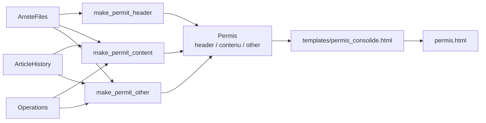

# Étape 4 — Rendering

Assemble le **permis consolidé HTML** à partir de l'historique des articles et
des arrêtés sources. Module :
[`ocapi/step_rendering/`](https://github.com/mte-dgpr/ocapi/tree/main/ocapi/step_rendering).

## Vue d'ensemble

Point d'entrée : [`step_rendering(history, operations, arrete_files)`](https://github.com/mte-dgpr/ocapi/blob/main/ocapi/step_rendering/step_rendering.py).
Le rendu final est composé via `Permis.to_html()` qui injecte les trois
fragments dans le template
[`templates/permis_consolide.html`](https://github.com/mte-dgpr/ocapi/blob/main/templates/permis_consolide.html)
(placeholders `{{HEADER}}`, `{{CONTENT}}`, `{{OTHER}}` requis).

## Header (`make_permit_header`)

[`ocapi/step_rendering/header.py`](https://github.com/mte-dgpr/ocapi/blob/main/ocapi/step_rendering/header.py)
produit l'en-tête du permis :

- **Titre** (`make_permit_title_spec`) — code AIOT (lève si plusieurs AIOT
  distincts dans la liste d'arrêtés).
- **Sources** (`make_permit_sources`) — liste chronologique des arrêtés sources
  avec leur titre Arrêtify et un marqueur visuel `(ABROGE)` si `status=False`.
- **Visas consolidés** (`make_permit_visa`) — visas extraits de chaque arrêté
  via `extract_specs(soup, "visa")`, regroupés par arrêté dans un `
`.
- **Motifs consolidés** (`make_permit_motif`) — symétrique sur les motifs.

Les arrêtés sont triés par `arrete_id` (date `YYYY-MM-DD`).

## Contenu principal (`make_permit_content`)

[`ocapi/step_rendering/main_content.py`](https://github.com/mte-dgpr/ocapi/blob/main/ocapi/step_rendering/main_content.py)
consolide un arrêté donné (le `<main>` et l'éventuel `<footer data-spec="appendix">`)
et le réutilise pour le contenu principal comme pour chaque AP complémentaire.
Le choix de l'AP principal est fait en amont par `_select_principal_ap`
([`step_rendering.py`](https://github.com/mte-dgpr/ocapi/blob/main/ocapi/step_rendering/step_rendering.py)) :

- si exactement un arrêté est marqué `principal=True`, c'est lui ;
- sinon, le dernier `AP_AUTORISATION` non abrogé (cas typique : refonte
  la plus récente) ;
- sinon le premier arrêté actif, ou à défaut `arrete_files[0]`.

Sur l'arrêté retenu, `make_permit_content` :

1. **Filtre les sections superflues** dans le `<main>`
   ([`article_filter.py`](https://github.com/mte-dgpr/ocapi/blob/main/ocapi/step_rendering/article_filter.py))
   — supprime les sections dont le titre normalisé matche une liste fixe
   (frais, publication, sanctions, exécution, recours…).
2. **Applique les dernières versions** : pour chaque section restante (et
   pour chaque section de l'appendix avec un id `APPENDIX:x.y`),
   `make_section_version` substitue le contenu issu de l'historique de cet
   arrêté (s'il y en a un).
3. **Insère les nouveaux articles** (`_insert_new_article_sections`) — pour
   chaque clé `NEW_ARTICLE:x.y` de l'historique attachée à l'arrêté traité,
   insère une nouvelle `<section>` après l'article numériquement précédent
   (ordre `article_id_sort_tuple`).
4. **Annotation des opérations** (`build_source_operation_messages`) —
   injecte des messages d'erreur ou d'information dans le corps pour les
   opérations émanant de cet arrêté.

## Autres (`make_permit_other`)

[`ocapi/step_rendering/other.py`](https://github.com/mte-dgpr/ocapi/blob/main/ocapi/step_rendering/other.py)
gère les arrêtés autres que l'AP principal. Chaque arrêté restant est
consolidé via `make_permit_content` (main + appendix avec leurs propres
versions d'articles), puis classé en deux familles :

- **Arrêtés modificatifs** (au moins une opération sortante non résolue) —
  rendus dans `permit_modifying_arretes`. C'est ce qui permet à un opérateur
  humain de retrouver les opérations qu'OCAPI n'a pas pu appliquer.
- **Arrêtés complémentaires** (aucune opération sortante) — rendus dans
  `permit_complements`.

Les arrêtés `status=False` (abrogés) sont filtrés. L'AP principal est sauté
car déjà rendu par le contenu principal.

## Filtrage des sections superflues

La liste blanche est codée en dur dans
[`article_filter.py`](https://github.com/mte-dgpr/ocapi/blob/main/ocapi/step_rendering/article_filter.py)
sous `_SUPERFLUOUS_TITLES`. Le matching utilise
`normalize_section_title` (insensible à la casse, aux accents, à la
ponctuation), comparé à la valeur de l'attribut `data-title` de la section.
Liste actuelle (extraits) :

- `MODALITÉS D'EXÉCUTION`, `EXÉCUTION`, `DÉLAIS`, `ÉCHÉANCES`,
- `FRAIS`, `SANCTIONS`,
- `DIFFUSION`, `PUBLICATION`, `PUBLICITÉ`, `AMPLIATION`,
- `INFORMATION DES TIERS`, `TRANSMISSION À L'EXPLOITANT`,
- `RECOURS`, `DÉLAIS ET VOIES DE RECOURS`,
- `MODIFICATIONS ET COMPLÉMENTS APPORTÉS AUX PRESCRIPTIONS DES ACTES ANTÉRIEURS`.

Pour ajouter un titre : éditer cette frozenset (les variantes accentuées /
ponctuées sont normalisées, donc inutile de toutes les lister).

## Template

`templates/permis_consolide.html` est un fichier statique chargé via
`settings.paths.permis_template_path`. La validation `Permis.to_html()`
vérifie la présence des trois placeholders et lève `ValueError` sinon. Pour
remplacer le template, modifier le fichier ou redéfinir
`PATHS__PERMIS_TEMPLATE_PATH` dans `.env`.

## Sortie

`step_rendering` retourne un objet `Permis`. La CLI (`main.py`) écrit le
résultat de `permis.to_html()` dans `arretes_consolidation/<aiot>/permis.html`.
