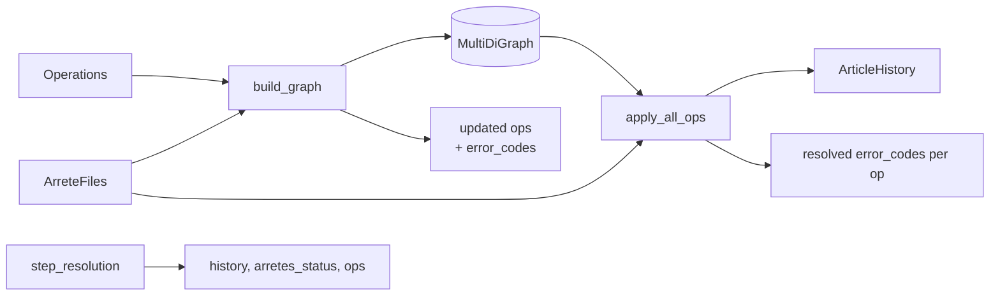

# Étape 3 — Resolution

C'est l'étape la plus dense d'OCAPI. À partir d'une `list[Operation]` et de la
liste d'`ArreteFile`, elle construit l'**historique des versions** de chaque
article impacté (`ArticleHistory`). Module :
[`ocapi/step_resolution/`](https://github.com/mte-dgpr/ocapi/tree/main/ocapi/step_resolution).

## Vue d'ensemble

Deux phases :

1. [`build_graph(ops, arrete_files)`](https://github.com/mte-dgpr/ocapi/blob/main/ocapi/step_resolution/build_op_graph.py)
   — construit un `networkx.MultiDiGraph` orienté avec les articles en nœuds
   et les opérations en arêtes. Traite à la volée les abrogations totales et
   les sections cibles introuvables.
2. [`apply_all_ops(graph, arrete_files, enable_llm=...)`](https://github.com/mte-dgpr/ocapi/blob/main/ocapi/step_resolution/apply_ops.py)
   — itère sur les arrêtés modificateurs dans l'ordre chronologique, applique
   chaque opération à la dernière version connue de l'article cible, et
   empile une nouvelle `ArticleVersion`.

## Construction du graphe

[`build_graph`](https://github.com/mte-dgpr/ocapi/blob/main/ocapi/step_resolution/build_op_graph.py)
parcourt les opérations dans l'ordre fourni (chronologique par `arrete_id`) :

- **Abrogation totale** (`REMOVE` ou `REPLACE` avec `target_article = "ALL"`
  et `sub_target = FULL_SECTION`, sans `error_codes`) → l'arrêté cible passe
  à `status = False`. Cas spécial : si la cible est l'arrêté `principal`,
  l'opération est rejetée avec `ERROR_EXTRACTING_TARGET` (vraisemblablement
  une fausse détection).
- **Cible introuvable** (arrêté `target` non chargé) → l'opération est
  ignorée et trackée dans `skipped_ops`.
- **Section cible/source introuvable** dans le HTML → un nœud vide est
  créé et l'opération est marquée `ERROR_EXTRACTING_TARGET` /
  `ERROR_EXTRACTING_SOURCE` ; elle restera dans le graphe pour traçabilité
  mais ne produira pas de version exploitable.
- Sinon, deux nœuds (source, target) sont ajoutés avec leur `(title, content)`
  extraits via `get_node_content` (gère `APPENDIX`, `APPENDIX:x.y`,
  `NEW_ARTICLE:x.y`), et une arête typée porte la sérialisation de l'opération.

`build_graph` retourne `(graph, arrete_files, skipped_ops, updated_ops)` :
les `updated_ops` portent les `error_codes` propagés à ce stade.

## Application des opérations

[`apply_all_ops`](https://github.com/mte-dgpr/ocapi/blob/main/ocapi/step_resolution/apply_ops.py)
itère sur les arrêtés **modificateurs** dans l'ordre chronologique. Pour
chaque article ciblé, il applique les opérations dans leur ordre du graphe
(`MultiDiGraph` préserve l'ordre d'insertion par paire `(source, target)`)
et empile une `ArticleVersion` à chaque succès.

Trois primitives :

- `apply_replace(op, soup, source_content=, enable_llm=)` — remplace le
  `sub_target` dans `soup` par `op.operand`.
- `apply_remove(op, soup, …)` — supprime le `sub_target`.
- `apply_add(op, soup, …)` — insère après le `sub_target`, ou crée un
  nouvel article si `target_article` commence par `NEW_ARTICLE:`.

Pour `REPLACE` et `REMOVE`, le pipeline tente d'abord une **résolution par
regex** sur les sous-cibles simples (`PHRASE`, `ALINEA`, `PARAGRAPHE`,
`TABLEAU`…) via [`utils/subtarget_utils.py`](https://github.com/mte-dgpr/ocapi/blob/main/ocapi/utils/subtarget_utils.py).
En cas d'ambiguïté (plusieurs matchs) ou si `sub_target.type == COMPLEX`,
on bascule sur le LLM (cf. [LLM § Prompts](../llm.md#prompts)).

### Sous-cibles complexes

Quand le LLM est requis, deux variables peuvent transformer l'appel en
échec contrôlé :

- `enable_llm=False` (mode snapshot) → `ErrorCode.DISABLED_LLM_CALL`,
  l'article reste à la version précédente, l'opération sort marquée comme
  non résolue.
- `ErrorCode.ERROR_EXTRACTING_SOURCE` déjà présent → on n'appelle pas le
  LLM (le source manque, la résolution n'aurait pas de sens).

### Propagation d'erreur

Une opération qui échoue n'empêche pas les suivantes d'être appliquées sur
le **même article** : la nouvelle tentative repart de la dernière version
valide. En revanche, la version produite porte
`ErrorCode.PROPAGATED_ERROR` quand elle dépend d'une version précédente
elle-même en erreur. Exception : les opérations « sans ambiguïté » qui
remplacent ou suppriment intégralement l'article
(`_is_unambiguous_all_operation`) écrasent la version courante quoi qu'il
arrive.

## ErrorCodes possibles

Définis dans [`ocapi/types.py`](https://github.com/mte-dgpr/ocapi/blob/main/ocapi/types.py) :

| Code | Origine | Sens court |
|---|---|---|
| `ERROR_EXTRACTING_OPERAND` | détection | Operand non extractible (marqueurs introuvables, target ALL+sub-target incohérent…). |
| `ERROR_EXTRACTING_SOURCE` | resolution | Section source absente du HTML. |
| `ERROR_EXTRACTING_TARGET` | resolution | Section cible absente, ou abrogation totale du `principal`. |
| `ERROR_FINDING_SUBTARGET` | resolution | Sous-cible non localisable. |
| `COMPLEX_SUBTARGET` | resolution | Sous-cible nécessitant un LLM ; informatif. |
| `DISABLED_LLM_CALL` | resolution | Sous-cible complexe rencontrée avec `enable_llm=False`. |
| `PROPAGATED_ERROR` | resolution | Une opération précédente sur l'article est en erreur. |

Les libellés français correspondants (utilisés dans le permis) sont dans
`ERROR_CODE_MESSAGES`.

## Sortie

`step_resolution` retourne :

- `history: ArticleHistory` — `Dict[NodeId, list[ArticleVersion]]`. Chaque
  version contient `version`, `title`, `content`, `operation_id` et
  optionnellement `error_codes`.
- `arrete_files` — la même liste passée en entrée, mais avec le `status`
  de l'arrêté à `False` pour ceux qui ont subi une abrogation totale.
- `operations` — copie des opérations avec les `error_codes` finaux résolus
  réécrits dessus (utiles au rendering pour décider quoi annoter).

## Cas limites connus

- Cycles dans le graphe (rare en pratique car les opérations vont d'un
  arrêté plus récent vers un plus ancien) : les arêtes restent en place
  mais leur application dépend de l'ordre d'itération.
- `NEW_ARTICLE:x.y` traité comme un nouvel article distinct (pas de fusion
  avec un article pré-existant qui aurait le même numéro).
- `target_article = "ALL"` avec un `sub_target` non `FULL_SECTION` : marqué
  `ERROR_EXTRACTING_OPERAND` dès la détection
  (`Operation._derive_detection_error_codes`) et donc non appliqué.
- Plusieurs opérations sur le même article au sein d'un même arrêté
  modificateur : appliquées dans l'ordre du graphe ; l'ordre exact peut
  être sensible à l'ordre du JSON renvoyé par le LLM.
