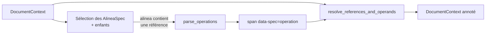

# Étape 0 — Tagging

Étape facultative qui enrichit le HTML Arrêtify d'**annotations sémantiques
d'opérations** (verbes « modifier », « abroger », « insérer »…) et résout les
références qu'elles portent. Module :
[`ocapi/step_tagging/`](https://github.com/mte-dgpr/ocapi/tree/main/ocapi/step_tagging).

## À quoi ça sert

Les opérations dans un arrêté préfectoral sont introduites par des formulations
récurrentes (`l'article X est modifié comme suit`, `il est ajouté un article Y`,
…). Plutôt que de relire ce repérage à chaque étape, OCAPI le matérialise
**une fois pour toutes** sous forme de balises sémantiques :

```html
<span data-spec="operation"
      data-operation_type="replace"
      data-direction="ltr"
      data-keyword="est modifié"
      data-references="ref-12">
  est modifié comme suit
</span>
```

Ces `<span>` sont posés dans la `protected_soup` Arrêtify et restent disponibles
pour la détection (filtrage rapide), pour le tagged HTML versionnable, et pour
toute analyse manuelle ultérieure.

## Quand est-ce exécuté

Dans `run_pipeline`, l'étape 0 tourne **avant la détection** dès que
`enable_tagging=True` et que des `document_contexts` sont fournis. La CLI
l'active par défaut ; la désactiver avec `--no-tagging` (les tags pré-existants
dans le HTML d'entrée sont alors utilisés tels quels).

## Pipeline interne



[`step_tagging(document_context)`](https://github.com/mte-dgpr/ocapi/blob/main/ocapi/step_tagging/step_tagging.py) :

1. Itère sur tous les `AlineaSpec` (et leurs descendants).
2. Si l'alinea contient une `DocumentReferenceSpec` ou une
   `SectionReferenceSpec`, appelle
   [`parse_operations`](https://github.com/mte-dgpr/ocapi/blob/main/ocapi/step_tagging/operations_detection.py)
   qui repère les verbes d'opération (ADD / DELETE / REPLACE) via des regexes
   sur les patterns français usuels (« il est inséré », « modifier »,
   « substituer », « abroger »…) et matérialise un `<span>` `OperationSpec`
   autour de l'expression matchée.
3. Pour chaque `<span>` `OperationSpec` produit, appelle
   [`resolve_references_and_operands`](https://github.com/mte-dgpr/ocapi/blob/main/ocapi/step_tagging/operands_detection.py)
   qui rattache la cible (références d'arrêtés / d'articles) et l'operand
   (texte de remplacement / d'insertion) à l'opération.

Le filtrage par présence de référence évite la majorité des faux positifs
(« la modification du débit dépasse… » ne déclenche pas de tag).

## Format `OperationSpec`

Défini dans
[`ocapi/semantic_tag_specs.py`](https://github.com/mte-dgpr/ocapi/blob/main/ocapi/semantic_tag_specs.py) :

| Attribut DOM | Sens | Valeurs |
|---|---|---|
| `data-spec` | identifiant de spec | `operation` |
| `data-operation_type` | type | `add` / `delete` / `replace` |
| `data-direction` | sens grammatical | `ltr` (sujet → cible) ou `rtl` (cible ← sujet) |
| `data-keyword` | extrait textuel du verbe | ex. `est modifié comme suit` |
| `data-references` | IDs des références cibles | liste séparée par espaces |
| `data-has_operand` | si un operand a été détecté | `true` / `false` |
| `data-operand` | operand brut | string optionnel |

> Note : ces `OperationType` (étape 0, valeurs minuscules `add` / `delete` /
> `replace`) sont **distincts** des `OperationType` de `ocapi/types.py` (étape 1,
> `ADD` / `REMOVE` / `REPLACE`). Les deux univers se rejoignent dans la
> détection mais ne partagent volontairement pas le même type Python.

## Sortie

`step_tagging` modifie le `DocumentContext` en place et le renvoie. Côté
pipeline, la `soup` du `ArreteFile` est rafraîchie depuis `document_context.soup`
juste après. La CLI écrit ensuite l'HTML annoté dans
`arretes_tagged/<aiot>/<filename>.html` via
[`save_tagged_html_file`](https://github.com/mte-dgpr/ocapi/blob/main/ocapi/utils/io_utils.py).

## Désactivation

- `run_pipeline(..., enable_tagging=False)` — saute l'étape (les éventuels
  tags déjà présents dans le HTML d'entrée sont utilisés tels quels).
- CLI : `ocapi run ... --no-tagging` ou `python -m ocapi.main ... --no-tagging`.

Utile pour rejouer un pipeline sur un HTML déjà taggué (ex. fixture, snapshot,
sortie sauvegardée), ou pour isoler un bug entre tagging et détection.

## Origine

Cette étape est **portée depuis** `arretify.step_consolidation` ; voir le
docstring de [`step_tagging.py`](https://github.com/mte-dgpr/ocapi/blob/main/ocapi/step_tagging/step_tagging.py).
À terme, si Arrêtify expose le module en public, OCAPI pourra réimporter
directement la dépendance plutôt que de maintenir une copie locale.
