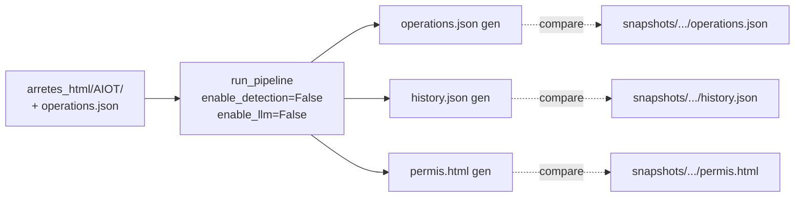

# Snapshot testing

Tests de **non-régression** du pipeline complet sur de vrais cas ICPE,
**sans LLM**. Permet de détecter qu'un changement (refactor, bump de
dépendance, modification d'une règle) casse une sortie consolidée pré-validée.

Pour le « pourquoi », voir
[ADR 0003](decision-records/0003-snapshot-testing.md).

## Comment ça marche

Chaque cas snapshot est défini comme un couple `(arretes_dir, consolidation_dir)`
dans
[`ocapi/snapshot.py`](https://github.com/mte-dgpr/ocapi/blob/main/ocapi/snapshot.py) :

```python
SNAPSHOT_CASES: list[tuple[Path, Path]] = [
    (snapshots/arretes_html/0003013459, snapshots/arretes_consolidation/0003013459),
    (snapshots/arretes_html/0005302394, snapshots/arretes_consolidation/0005302394),
    (snapshots/arretes_html/0005800425, snapshots/arretes_consolidation/0005800425),
    (snapshots/arretes_html/0005804239, snapshots/arretes_consolidation/0005804239),
]
```

`arretes_dir` contient les HTMLs Arrêtify d'entrée. `consolidation_dir` contient
les sorties attendues : `operations.json` (chargé en pre-load),
`history.json` et `permis.html`.

Le test
[`snapshot_test.py`](https://github.com/mte-dgpr/ocapi/blob/main/ocapi/snapshot_test.py)
rejoue `run_pipeline` avec :

- `enable_detection=False` — pas d'appel LLM en détection ;
- `enable_llm=False` — pas d'appel LLM en résolution non plus (les sous-cibles
  complexes sortent en `DISABLED_LLM_CALL`) ;
- `operations=load_operations(consolidation_dir)` — opérations pré-chargées
  depuis `operations.json` figé.

Puis il compare les trois sorties à celles déjà sur disque
(`operations.json`, `history.json`, `permis.html`). Comparaison exacte après
normalisation (`strip_none_values` pour le JSON, `normalize_html` pour le
permis).

Un second test (`test_snapshot_pipeline_is_deterministic`) rejoue le pipeline
deux fois et vérifie que les sorties sont identiques d'un run à l'autre.



## Lancer les snapshots

```bash
pytest -m snapshot -v
```

En CI les snapshots ne tournent **qu'en pull request**, voir
[`.github/workflows/ci.yml`](https://github.com/mte-dgpr/ocapi/blob/main/.github/workflows/ci.yml) :

```yaml
- name: Run snapshot tests
  if: github.event_name == 'pull_request'
  timeout-minutes: 5
  run: pytest -m snapshot -v --no-cov
```

Les unit tests classiques (`pytest -m "not snapshot"`) tournent sur chaque push.

## Mettre à jour les snapshots

Quand un changement **intentionnel** modifie une sortie, il faut régénérer les
fichiers attendus :

```bash
# Option 1 : commande dédiée
ocapi update-snapshots

# Option 2 : variable d'environnement directement avec pytest
UPDATE_SNAPSHOTS=1 pytest -m snapshot -v
```

Effets :

- chaque fichier attendu (`operations.json`, `history.json`, `permis.html`)
  est réécrit avec la sortie courante (JSON sérialisé `indent=2 sort_keys=True`,
  HTML normalisé) ;
- le test est marqué `skipped` (« Snapshots updated. Run without
  `UPDATE_SNAPSHOTS=1` to verify. ») — relancer sans la variable pour
  confirmer.

Réviser ensuite **manuellement** le diff git pour s'assurer que la nouvelle
sortie est bien celle attendue avant de committer.

## Ajouter un cas snapshot

1. Créer le répertoire `snapshots/arretes_html/<NOUVEL_AIOT>/` et y déposer
   les HTMLs Arrêtify d'entrée (versions compatibles).
2. Générer une fois `operations.json` **avec LLM** sur cet AIOT (le pipeline
   normal écrit dans `arretes_consolidation/` par défaut) :

   ```bash
   ocapi run snapshots/arretes_html/<NOUVEL_AIOT>/ \
       --output snapshots/arretes_consolidation/<NOUVEL_AIOT>/
   ```

3. Vérifier manuellement que `operations.json` est correct (corriger à la main
   au besoin — il sert de source de vérité pour les futurs runs sans LLM).
4. Ajouter le couple à `SNAPSHOT_CASES` dans
   [`ocapi/snapshot.py`](https://github.com/mte-dgpr/ocapi/blob/main/ocapi/snapshot.py).
5. Lancer `UPDATE_SNAPSHOTS=1 pytest -m snapshot -v` pour générer
   `history.json` et `permis.html` attendus.
6. Re-lancer `pytest -m snapshot -v` pour vérifier que tout passe.
7. Committer.

## Déboguer un échec

`pytest -m snapshot -v` rapporte le fichier en cause :

```
AssertionError: Snapshot mismatch: history.json
```

Marche à suivre :

1. **Lancer juste le cas concerné** :

   ```bash
   pytest -m snapshot -v -k 0003013459
   ```

2. **Régénérer en local sans committer** pour voir le diff :

   ```bash
   UPDATE_SNAPSHOTS=1 pytest -m snapshot -v -k 0003013459
   git diff snapshots/arretes_consolidation/0003013459/
   ```

3. **Analyser le diff** :
    - changement attendu (refactor, nouvelle règle) → garder le diff,
      committer ;
    - changement non voulu → `git checkout -- snapshots/...` pour annuler la
      régénération, et corriger le code.

4. Pour un diff plus lisible côté permis :

   ```bash
   open snapshots/arretes_consolidation/<aiot>/permis.html
   ```

   et comparer visuellement avec une version stockée localement.

## Pourquoi pas de LLM en CI ?

- **Reproductibilité** : pas de variation entre runs.
- **Coût** : pas d'appel API par PR.
- **Vitesse** : l'ensemble passe en quelques secondes.
- **Périmètre** : on teste la pipeline déterministe (resolution + rendering)
  sur des opérations figées, pas le LLM lui-même. La qualité de la détection
  est mesurée séparément par `scripts/evaluate_detection.py` (voir
  [Évaluation](evaluation.md)).
