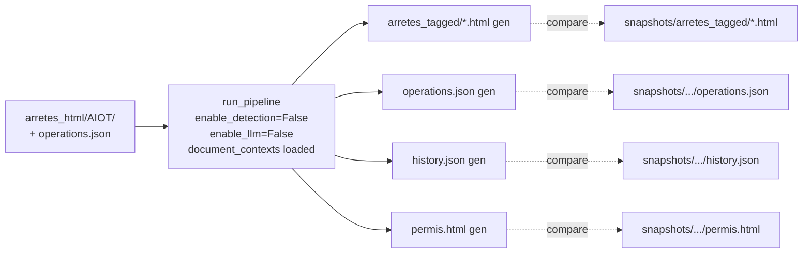

# Snapshot testing

Tests de **non-régression** du pipeline complet sur de vrais cas ICPE,
**sans LLM**. Permet de détecter qu'un changement (refactor, bump de
dépendance, modification d'une règle) casse une sortie consolidée pré-validée.

Pour le « pourquoi », voir
[ADR 0003](decision-records/0003-snapshot-testing.md).

## Utilité

Trois usages au quotidien :

- **Garde-fou de non-régression** : à chaque PR la CI rejoue le pipeline
  complet (sans LLM) sur 4 AIOT réels et compare les sorties bit-à-bit. Un
  refactor qui casserait silencieusement le rendering ou la résolution est
  attrapé immédiatement.
- **Référentiel reproductible** : les `operations.json` figés font office de
  vérité terrain pour la partie déterministe du pipeline (resolution +
  rendering). Ça évite de redépendre du LLM pour rejouer un cas.
- **Cas d'étude** : quand on debugge un comportement précis, on peut isoler
  un AIOT (`pytest -m snapshot -k <aiot>`) et observer le diff `permis.html`
  ou `history.json` pour comprendre l'effet d'un changement.

## Structure des snapshots

Trois répertoires versionnés par cas, un AIOT par couple :

| Répertoire | Contenu | Rôle |
| --- | --- | --- |
| `snapshots/arretes_html/<AIOT>/` | HTMLs **d'entrée** (sortie Arrêtify) | input du pipeline en mode snapshot |
| `snapshots/arretes_tagged/<AIOT>/` | HTMLs après `step_tagging` | baseline de non-régression du tagging |
| `snapshots/arretes_consolidation/<AIOT>/` | `operations.json`, `history.json`, `permis.html` | sortie attendue à comparer |

Le couple est référencé dans
[`ocapi/snapshot.py`](https://github.com/mte-dgpr/ocapi/blob/main/ocapi/snapshot.py) :

```python
SNAPSHOT_CASES: list[tuple[Path, Path]] = [
    (snapshots/arretes_html/0003013459, snapshots/arretes_consolidation/0003013459),
    (snapshots/arretes_html/0005302394, snapshots/arretes_consolidation/0005302394),
    (snapshots/arretes_html/0005800425, snapshots/arretes_consolidation/0005800425),
    (snapshots/arretes_html/0005804239, snapshots/arretes_consolidation/0005804239),
]
```

Dans `arretes_consolidation/<AIOT>/`, `operations.json` est l'**entrée**
préchargée (résultat figé de la détection LLM, validé manuellement) ;
`history.json` et `permis.html` sont les **sorties attendues** comparées
à chaque run.

Le test
[`snapshot_test.py`](https://github.com/mte-dgpr/ocapi/blob/main/ocapi/snapshot_test.py)
rejoue `run_pipeline` avec :

- `enable_detection=False` — pas d'appel LLM en détection ;
- `enable_llm=False` — pas d'appel LLM en résolution non plus (les sous-cibles
  complexes sortent en `DISABLED_LLM_CALL`) ;
- `document_contexts=load_document_contexts(...)` — exécute explicitement
   `step_tagging` avant la détection ;
- `operations=load_operations(consolidation_dir)` — opérations pré-chargées
  depuis `operations.json` figé.

Puis il compare les sorties à celles déjà sur disque :

- `operations.json`, `history.json`, `permis.html` dans `arretes_consolidation` ;
- chaque HTML taggé dans `arretes_tagged`.

Comparaison exacte après normalisation (`strip_none_values` pour le JSON,
`normalize_html` pour le HTML consolidé et les HTML taggés).

Un second test (`test_snapshot_pipeline_is_deterministic`) rejoue le pipeline
deux fois et vérifie que les sorties sont identiques d'un run à l'autre.



## Lancer les snapshots

```bash
pytest -m snapshot -v
```

En CI les snapshots ne tournent **qu'en pull request**, voir
[`.github/workflows/ci.yml`](https://github.com/mte-dgpr/ocapi/blob/main/.github/workflows/ci.yml) :

```yaml
- name: Run snapshot tests
  if: github.event_name == 'pull_request'
  timeout-minutes: 5
  run: pytest -m snapshot -v --no-cov
```

Les unit tests classiques (`pytest -m "not snapshot"`) tournent sur chaque push.

## Mettre à jour les snapshots

### Quand régénérer ?

| Situation | Quel snapshot | Pourquoi |
| --- | --- | --- |
| Refactor du resolution ou du rendering qui change la sortie | `history.json` et/ou `permis.html` | sorties calculées, à reflasher |
| Nouvelle règle (filtrage, error_code, etc.) qui modifie le résultat consolidé | `history.json`, `permis.html`, parfois `operations.json` | la règle peut altérer la résolution ou ajouter des codes |
| Bump d'Arrêtify (HTML d'entrée tagué différemment) | `arretes_html/` puis tout le reste | l'input change, tout le pipeline dérive |
| Nouvelle détection LLM (pattern de `step_tagging`, prompt amélioré) | `operations.json` après re-run **avec LLM**, puis le reste | la détection produit de nouvelles ops |
| Ajout d'un nouveau cas AIOT | tout | voir [Ajouter un cas snapshot](#ajouter-un-cas-snapshot) |

Toujours réviser **manuellement** le diff Git avant de committer : un snapshot
qui change sans qu'on s'y attende = bug à investiguer, pas juste à entériner.

### Régénérer les sorties attendues (`history.json`, `permis.html`)

C'est le cas le plus fréquent : on a touché au code, `operations.json` reste
valide, on veut juste rafraîchir les sorties calculées.

```bash
# Option 1 : commande dédiée
ocapi update-snapshots

# Option 2 : variable d'environnement directement avec pytest
UPDATE_SNAPSHOTS=1 pytest -m snapshot -v
```

Effets :

- chaque fichier attendu (`operations.json`, `history.json`, `permis.html`)
  est réécrit avec la sortie courante (JSON sérialisé `indent=2 sort_keys=True`,
  HTML normalisé) ;
- chaque HTML de `snapshots/arretes_tagged/<AIOT>/` est aussi réécrit avec
   la sortie courante de `step_tagging` ;
- le test est marqué `skipped` (« Snapshots updated. Run without
  `UPDATE_SNAPSHOTS=1` to verify. ») — relancer sans la variable pour
  confirmer.

`operations.json` est aussi réécrit, mais avec les mêmes ops préchargées —
le diff sur ce fichier est souvent nul (ou limité à du reformatage), mais un
diff peut aussi être légitime si les règles de fusion d'opérations ont changé
(déduplication, priorité aux sous-cibles les plus précises, renumérotation en
cas de collision d'IDs).

Un diff sur `operations.json` doit donc être revu au fond :

- **attendu** si une règle de fusion/normalisation a été modifiée,
- **suspect** s'il n'y a pas eu de changement de logique de pipeline.

### Régénérer `operations.json` (avec LLM)

Quand on a changé la détection (prompt LLM, regex de `step_tagging`, parsing
des réponses), il faut rejouer le pipeline **avec LLM** pour produire de
nouveaux `operations.json` :

```bash
ocapi run snapshots/arretes_html/<AIOT>/ \
    --output snapshots/arretes_consolidation/<AIOT>/
```

Puis :

1. **Inspecter** manuellement le diff sur `operations.json` (nouvelles ops,
   changements de type, error_codes ajoutés).
2. **Corriger à la main** ce qui n'est pas conforme à la vérité terrain — le
   LLM est faillible et `operations.json` est la **source de vérité** pour les
   runs sans LLM.
3. Régénérer les sorties dérivées :

   ```bash
   UPDATE_SNAPSHOTS=1 pytest -m snapshot -v -k <AIOT>
   ```

4. Vérifier :

   ```bash
   pytest -m snapshot -v -k <AIOT>
   ```

### Régénérer les HTMLs d'entrée (`arretes_html/`)

À ne faire que lors d'un **bump d'Arrêtify** ou si on veut récupérer un
re-tagging de `step_tagging` après changement des règles de tagging.

Workflow :

1. Récupérer les sorties Arrêtify mises à jour pour chaque AIOT (Arrêtify
   produit du HTML déjà tagué, voir [ADR 0004](decision-records/0004-arretify-version-pin.md)).
2. Les déposer dans `snapshots/arretes_html/<AIOT>/`.
3. Re-jouer une **détection complète avec LLM** comme ci-dessus, car les
   `operations.json` figés ne sont plus alignés avec la nouvelle structure HTML.
4. Régénérer les sorties dérivées et committer.

> Note : `step_tagging` est idempotent sur du HTML déjà tagué pour les balises
> `operation` : le pipeline strip d'abord les anciens
> `<span data-spec="operation">` (en conservant le contenu), puis retague.
> Les snapshots `arretes_tagged` protègent ce comportement.

## Ajouter un cas snapshot

1. Créer le répertoire `snapshots/arretes_html/<NOUVEL_AIOT>/` et y déposer
   les HTMLs Arrêtify d'entrée (versions compatibles).
2. Générer une fois `operations.json` **avec LLM** sur cet AIOT (le pipeline
   normal écrit dans `arretes_consolidation/` par défaut) :

   ```bash
   ocapi run snapshots/arretes_html/<NOUVEL_AIOT>/ \
       --output snapshots/arretes_consolidation/<NOUVEL_AIOT>/
   ```

3. Vérifier manuellement que `operations.json` est correct (corriger à la main
   au besoin — il sert de source de vérité pour les futurs runs sans LLM).
4. Ajouter le couple à `SNAPSHOT_CASES` dans
   [`ocapi/snapshot.py`](https://github.com/mte-dgpr/ocapi/blob/main/ocapi/snapshot.py).
5. Lancer `UPDATE_SNAPSHOTS=1 pytest -m snapshot -v` pour générer
   `history.json` et `permis.html` attendus.
6. Re-lancer `pytest -m snapshot -v` pour vérifier que tout passe.
7. Committer.

## Déboguer un échec

`pytest -m snapshot -v` rapporte le fichier en cause :

```
AssertionError: Snapshot mismatch: history.json
```

Marche à suivre :

1. **Lancer juste le cas concerné** :

   ```bash
   pytest -m snapshot -v -k 0003013459
   ```

2. **Régénérer en local sans committer** pour voir le diff :

   ```bash
   UPDATE_SNAPSHOTS=1 pytest -m snapshot -v -k 0003013459
   git diff snapshots/arretes_consolidation/0003013459/
   ```

3. **Analyser le diff** :
    - changement attendu (refactor, nouvelle règle) → garder le diff,
      committer ;
    - changement non voulu → `git checkout -- snapshots/...` pour annuler la
      régénération, et corriger le code.

4. Pour un diff plus lisible côté permis :

   ```bash
   open snapshots/arretes_consolidation/<aiot>/permis.html
   ```

   et comparer visuellement avec une version stockée localement.

## Pourquoi pas de LLM en CI ?

- **Reproductibilité** : pas de variation entre runs.
- **Coût** : pas d'appel API par PR.
- **Vitesse** : l'ensemble passe en quelques secondes.
- **Périmètre** : on teste la pipeline déterministe (resolution + rendering)
  sur des opérations figées, pas le LLM lui-même. La qualité de la détection
  est mesurée séparément par `scripts/evaluate_detection.py` (voir
  [Évaluation](evaluation.md)).
